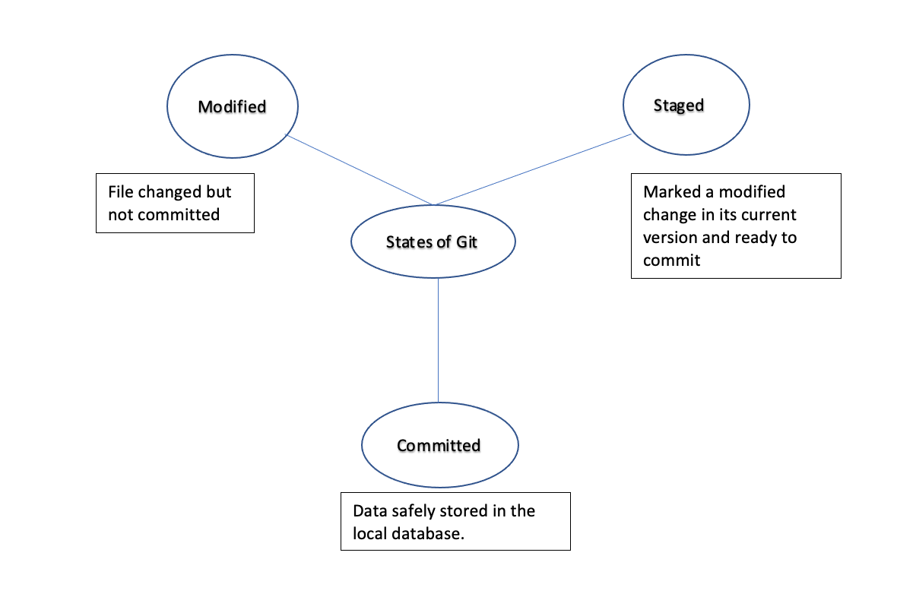

# GIT & GITHUB

## GIT

* A versioning tool
* Takes snapshot of the data of your filesystem and stores a reference to that snapshot.
* Mostlty localised operation
* Ensures integrity - Basically ensures that no changes go unseen.

### Stages in Git

## GITHUB

* Code hosting platform for version control and collaborations
* User friendly environment to create, edit or share codes across projects.

### Various features in Github

* Repository - A project that holds all files and data related to the project.
* Branch - Helps to create different versions of the same project. Main / Master is the default branch. You can create any number of branches under the main branch.
* Commit -  Saved changes are refered to as commits.
* Pull Request - A method of proposing your changes and asking for review and also place a request to compare and merge the code to the main branch of the same repository or other repositories.
* Fork - Making a copy of a repository. This helps in code reusability or to suggest changes to a code in another repository.
* Clone - Pulling a full copy of all the files and related data of a repository in GitHub.com to a local machine. This makes it easier to fix merge conflicts, add or remove files, and push larger commits.

